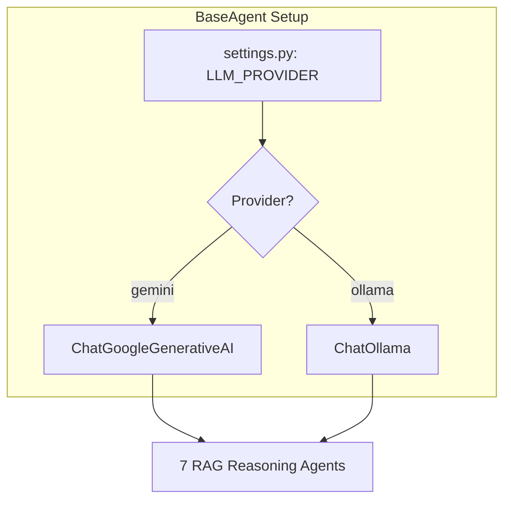

# Improvised Implementation Plan: LangGraph Self-Correcting Multi-Agent RAG with Local LLM (Ollama) Support

Build a production-quality, modular self-correcting RAG workflow using LangGraph and LangChain, supporting both Gemini and local offline models (via Ollama).

---

## 1. Multi-Provider Architecture



---

## 2. Directory Structure

We will modify:

* `backend/app/config/settings.py` (Add Provider and Model variables)
* `backend/app/services/agents/base_agent.py` (Add dynamic model initializer)
* `backend/.env` & `.env` (Add provider toggles)

---

## 3. Configuration Additions

We add the following variables to `.env`:

```ini
# LLM Provider: "gemini" or "ollama"
LLM_PROVIDER=ollama
OLLAMA_MODEL=qwen2.5-coder:7b
OLLAMA_BASE_URL=http://localhost:11434
```

---

## 4. LLM Initialization Logic (`backend/app/services/agents/base_agent.py`)

```python
from langchain_community.chat_models import ChatOllama
from langchain_google_genai import ChatGoogleGenerativeAI

def _init_llm(self):
    if settings.LLM_PROVIDER == "ollama":
        self._llm_instance = ChatOllama(
            model=settings.OLLAMA_MODEL,
            base_url=settings.OLLAMA_BASE_URL,
            temperature=0.0
        )
    else:
        self._llm_instance = ChatGoogleGenerativeAI(
            model=self.model_name,
            google_api_key=settings.GEMINI_API_KEY
        )
```

---

## 5. Verification Plan
* Start Ollama locally: `ollama run qwen2.5-coder:7b` (or another installed model).
* Run the integration tests using the local model to verify intent classification and RAG responses.
