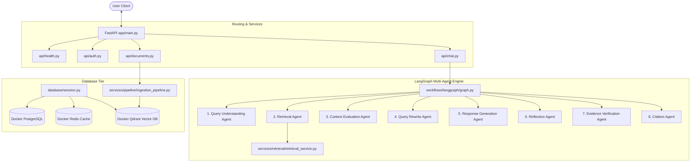

# Veritas AI - Progress Walk-through

This document outlines the entire set of features, pipelines, and agents implemented so far on the `main` branch.

---

## 1. System Architecture Map (Current State)



---

## 2. Completed Components

### A. Infrastructure & Database Schema
* **[docker-compose.yml](file:///c:/Users/DKDHA/Desktop/Veritas%20AI/Veritas-AI/docker-compose.yml)**: Runs PostgreSQL, Redis, and Qdrant.
* **Alembic Migrations**: Fully initialized and upgraded.
* **Database Models (`backend/app/models/`)**:
  * `User`: Credentials, documents, and chat sessions.
  * `Document`: File meta-information, duplicate checksum checks, and page counts.
  * `DocumentChunk`: Text slices, token counts, and matching Qdrant vector references.
  * `ProcessingJob`: Status tracking logs (queued -> parsing -> cleaning -> chunking -> embedding -> indexing -> completed).
  * `ChatMessage` & `ChatSession`: Persistent conversation histories, numerical confidence metrics, and citations.
  * `Feedback`: User comments and evaluations.

### B. Ingestion & Retrieval Services (`backend/app/services/`)
* **Parsers (`parsers/`)**: `BaseParser` interface with factory returning PDF (`PyMuPDF`), Word (`python-docx`), TXT (`TextParser`), or MD (`MarkdownParser`).
* **Preprocessing (`preprocessing/`)**: `TextCleaner` resolving Unicode normalization, ligatures (e.g. `fi` -> `fi`), multiple spaces, and hyphen line breaks.
* **Chunking (`chunking/`)**: `RecursiveChunker` wrapping LangChain's splitting utility configured at 800-1000 characters.
* **Embeddings (`embeddings/`)**: Thread-safe class-level cached loading of `BAAI/bge-small-en-v1.5` on startup.
* **Vector Store (`vectorstore/`)**: `QdrantService` handling collections, bulk payload uploads, and query/scroll text matches.
* **Retrieval Engine (`retrieval/`)**: `RetrievalService` running semantic search + keyword search and merging matches with Reciprocal Rank Fusion (RRF).
* **Ingestion Pipeline (`pipeline/`)**: `IngestionPipeline` triggered asynchronously via `BackgroundTasks` capturing execution latency metrics.

### C. Self-Correcting LangGraph Agent Engine
* **Prompts (`prompts/`)**: Isolated `.txt` templates (query understanding, context grading, rewrites, answer generation, reflection, and evidence verification) supporting hot-reloading.
* **Agents (`services/agents/`)**: Fully structured agents subclassing `BaseAgent`.
* **Citation Agent (`citation_agent.py`)**: Maps chunk IDs, replaces source indexes, and formats citation references.
* **State Graph (`workflows/langgraph/`)**: State definition (`state.py`), transitions nodes (`nodes.py`), and conditional routing logic (`router.py`) compiled together inside `graph.py`.

---

## 3. How to Run the App & Tests

```bash
# 1. Start Docker services
docker-compose up -d

# 2. Run integration unit tests
backend\.venv\Scripts\python backend/tests/test_ingestion_retrieval.py
backend\.venv\Scripts\python backend/tests/test_langgraph_rag.py

# 3. Start the FastAPI API Server
cd backend
.venv\Scripts\uvicorn app.main:app --reload
```
Interact with endpoints via **`http://127.0.0.1:8000/docs`**.
