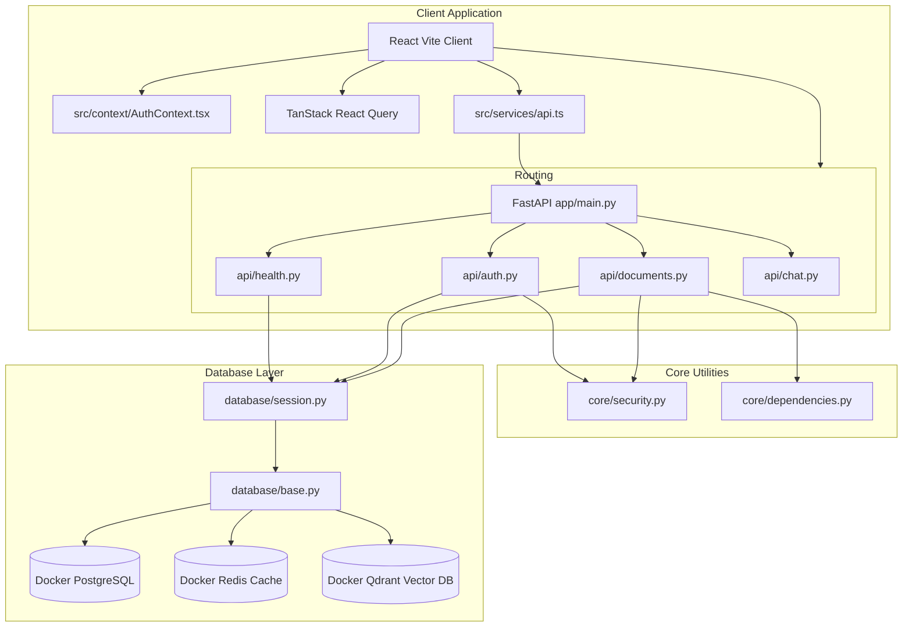

# Veritas AI - Progress Walk-through

This document outlines the entire set of features and files implemented so far on the `main` branch.

---

## 1. System Architecture Map (Implemented)



---

## 2. Completed Components

### A. Infrastructure & Configuration
* **[docker-compose.yml](file:///c:/Users/DKDHA/Desktop/Veritas%20AI/Veritas-AI/docker-compose.yml)**: Spins up PostgreSQL (5432), Redis (6379), and Qdrant (6333/6334) with healthchecks.
* **[.env.example](file:///c:/Users/DKDHA/Desktop/Veritas%20AI/Veritas-AI/.env.example)**: Example environment settings.
* **[backend/app/config/settings.py](file:///c:/Users/DKDHA/Desktop/Veritas%20AI/Veritas-AI/backend/app/config/settings.py)**: Dynamic Pydantic BaseSettings class loading configuration variables, featuring a `get_database_url()` builder.

### B. Database & Schema Migrations
* **[backend/app/database/session.py](file:///c:/Users/DKDHA/Desktop/Veritas%20AI/Veritas-AI/backend/app/database/session.py)**: SQLAlchemy engine configuration with pool recycling and connection checks.
* **[backend/app/database/base_class.py](file:///c:/Users/DKDHA/Desktop/Veritas%20AI/Veritas-AI/backend/app/database/base_class.py)**: Declarative base base utility dynamically mapping subclass names to snake_case database tables.
* **[backend/app/database/base.py](file:///c:/Users/DKDHA/Desktop/Veritas%20AI/Veritas-AI/backend/app/database/base.py)**: Unified registration import mapping all schemas.
* **[backend/alembic/env.py](file:///c:/Users/DKDHA/Desktop/Veritas%20AI/Veritas-AI/backend/alembic/env.py)**: Dynamic Alembic database setup linking settings database URL to autogenerate migration tracks.
* **Models File Structure**:
  * **[user.py](file:///c:/Users/DKDHA/Desktop/Veritas%20AI/Veritas-AI/backend/app/models/user.py)**: User model.
  * **[document.py](file:///c:/Users/DKDHA/Desktop/Veritas%20AI/Veritas-AI/backend/app/models/document.py)**: Document, DocumentChunk, and ProcessingJob models.
  * **[chat.py](file:///c:/Users/DKDHA/Desktop/Veritas%20AI/Veritas-AI/backend/app/models/chat.py)**: ChatSession and ChatMessage models.
  * **[feedback.py](file:///c:/Users/DKDHA/Desktop/Veritas%20AI/Veritas-AI/backend/app/models/feedback.py)**: Feedback model.

### C. Security & JWT Authentication
* **[backend/app/core/security.py](file:///c:/Users/DKDHA/Desktop/Veritas%20AI/Veritas-AI/backend/app/core/security.py)**: PBKDF2-HMAC-SHA256 password hashing and PyJWT token generation/decoding.
* **[backend/app/core/dependencies.py](file:///c:/Users/DKDHA/Desktop/Veritas%20AI/Veritas-AI/backend/app/core/dependencies.py)**: Dependency injection handler verifying JWT tokens and fetching authenticated users.
* **[backend/app/schemas/user.py](file:///c:/Users/DKDHA/Desktop/Veritas%20AI/Veritas-AI/backend/app/schemas/user.py)**: Pydantic schemas validating credentials.
* **[backend/app/api/auth.py](file:///c:/Users/DKDHA/Desktop/Veritas%20AI/Veritas-AI/backend/app/api/auth.py)**: Auth router with endpoints:
  * `POST /api/v1/auth/register` - Create user.
  * `POST /api/v1/auth/login` - Verify credentials and return OAuth2 token.

### D. Document APIs
* **[backend/app/schemas/document.py](file:///c:/Users/DKDHA/Desktop/Veritas%20AI/Veritas-AI/backend/app/schemas/document.py)**: Document response models.
* **[backend/app/api/documents.py](file:///c:/Users/DKDHA/Desktop/Veritas%20AI/Veritas-AI/backend/app/api/documents.py)**: Document route controls:
  * `POST /api/v1/documents/upload` - Save file stream, check format support, calculate SHA-256 for duplicate matching, write cache, save to DB, and initialize ingestion job.
  * `GET /api/v1/documents` - Fetch user's uploaded files.
  * `DELETE /api/v1/documents/{id}` - Clean local storage cache and clear DB records.
  * `GET /api/v1/documents/{document_id}/status` - Polling status progress details for uploads.

### E. React 19 + Vite Frontend Client [NEW]
* **Page Views (`frontend/src/pages/`)**:
  * **[Login.tsx](file:///c:/Users/DKDHA/Desktop/Veritas%20AI/Veritas-AI/frontend/src/pages/Login.tsx) & [Register.tsx](file:///c:/Users/DKDHA/Desktop/Veritas%20AI/Veritas-AI/frontend/src/pages/Register.tsx)**: Authentication panel wrappers.
  * **[Dashboard.tsx](file:///c:/Users/DKDHA/Desktop/Veritas%20AI/Veritas-AI/frontend/src/pages/Dashboard.tsx)**: Aggregates upload counters and tables.
  * **[ChatConsole.tsx](file:///c:/Users/DKDHA/Desktop/Veritas%20AI/Veritas-AI/frontend/src/pages/ChatConsole.tsx)**: Displays the three-panel layout (Sidebar Navigation, Central Message Thread, and the Right Evidence Workspace).
  * **[Settings.tsx](file:///c:/Users/DKDHA/Desktop/Veritas%20AI/Veritas-AI/frontend/src/pages/Settings.tsx)**: Configures diagnostics and data layers.
* **State Management**:
  * **[providers.tsx](file:///c:/Users/DKDHA/Desktop/Veritas%20AI/Veritas-AI/frontend/src/app/providers.tsx)**: Mounts React Query configuration.
  * **[AuthContext.tsx](file:///c:/Users/DKDHA/Desktop/Veritas%20AI/Veritas-AI/frontend/src/context/AuthContext.tsx)**: Automatically handles token interceptors and session refreshes.

---

## 3. How to Start and Verify

```bash
# 1. Start Docker Containers
docker-compose up -d

# 2. Start Backend FastAPI Server
cd backend
.venv\Scripts\uvicorn app.main:app --reload

# 3. Start Frontend Client (New Window)
cd frontend
npm run dev
```

Navigate to **`http://localhost:5173`** to interact with the React interface.
